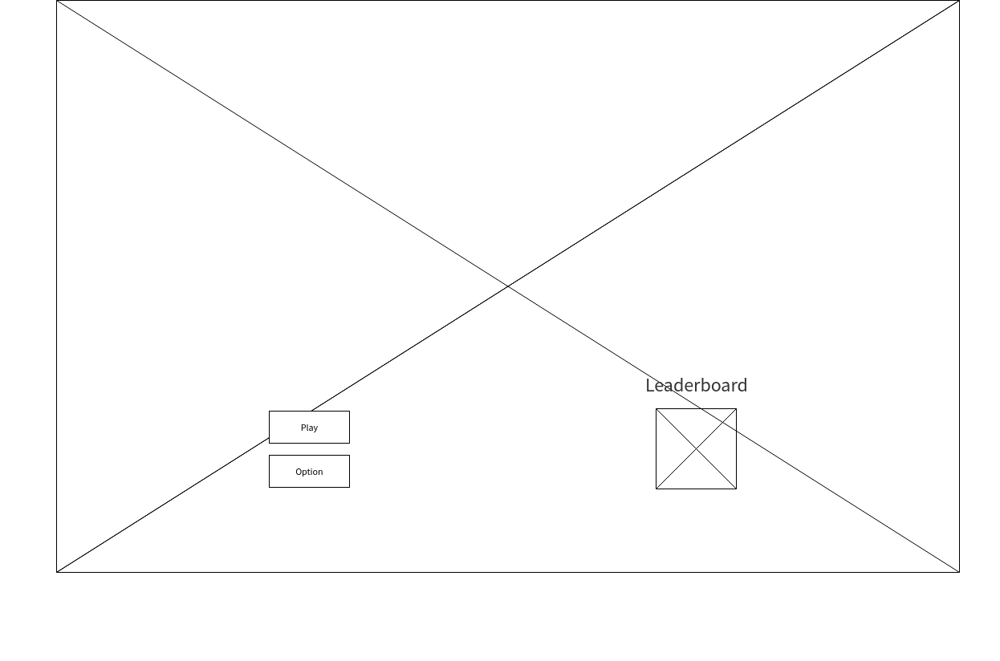
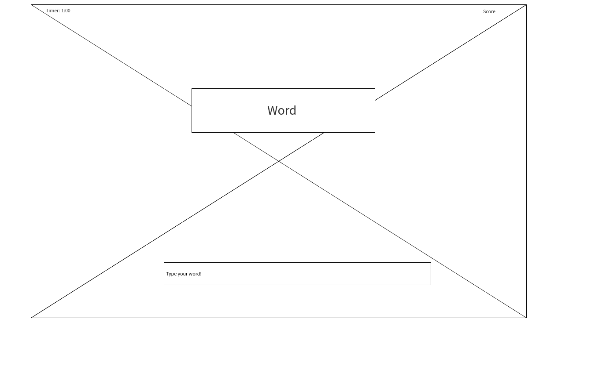
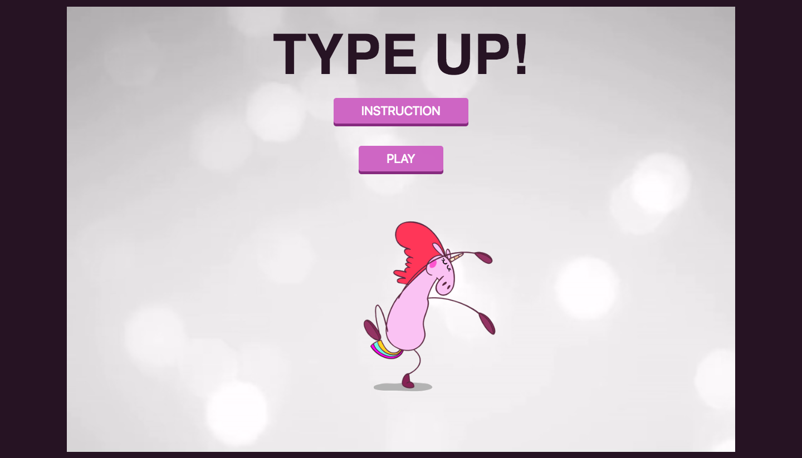

# Game Project - Type your words!
* Make a functional game using HTML, CSS and JavaScript
#### Game must include:
  * An instruction section explaining how to play the Game
  * Either display a message when the user has won, or a score after the game has ended
  * Be styled to perfection
  * Must have a leaderboard
  * Must be 2 players
### Bonus
  * User is able to play against computer
  * Use fancy animations
  * Use HTML5 to include audio, and/or sound effects

---
## Sprint timeline
1st Sprint - Wednesday morning  
2nd Sprint - Friday afternoon
* Must prepare a 5-minutes presentation
---
Files must be structured appropriately
```
+-- project-one
|	+--js
|		--main.js
|	+--css
|		--style.css
|	+--images
|	--index.html
```
---
# Project Objectives
* To pull everything together by building a small web application from the ground up.
* To demonstrate mastery of topics covered during this course so far.
* To demonstrate the quality of communication around your decision-making.
---
## User Story  

User will be able to type words as an input into the game. User will need to play the game under a time constraint of 1:00 minute (60 seconds). User will need to type up as many words as they can correctly. Scores will be based upon how many correct words the user has typed up in that 1 minute. Player 1 will play the game first, and player 2 will follow. Scores will get compared at the end of two rounds, and the winner will be declared.  

Possible features
* User can choose different level of difficulties
* User can extend time
* User can input their own words for harder round
---
## Wireframes
User will first see the "Play", and "Option" buttons, along with an access to the "leaderboard".



When user clicks on the "Play" button, the user will see a display of a count



---

## Final Product



Some of the possible features were added. The game has two levels of difficulties. 
